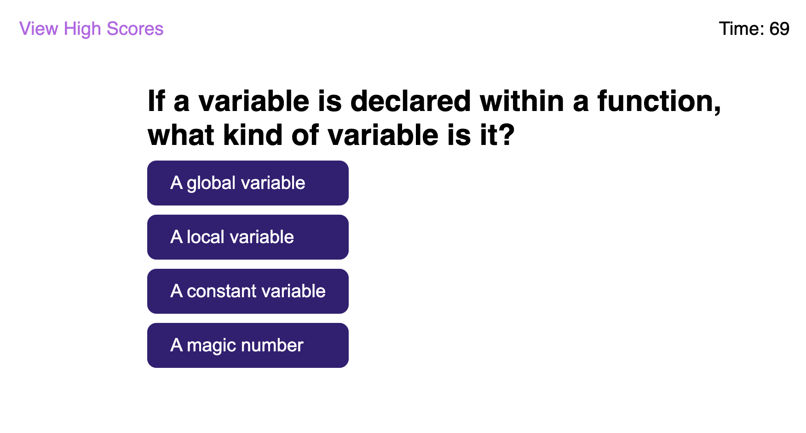

# Code Quiz
A short quiz for beginning web developers

## Site Link

<https://twyllblackleaf.github.io/code-quiz/>

## Features

- Five questions about JavaScript and HTML
- Scoring based on time kept by a timer
- Penalties for wrong answers that subtract from time remaining
- High scores stored in localStorage
- CSS styling from scratch to match a mockup

## About Me

Kat Dixon is a developing developer with interests in accessibility, security, and the intersections between the two.